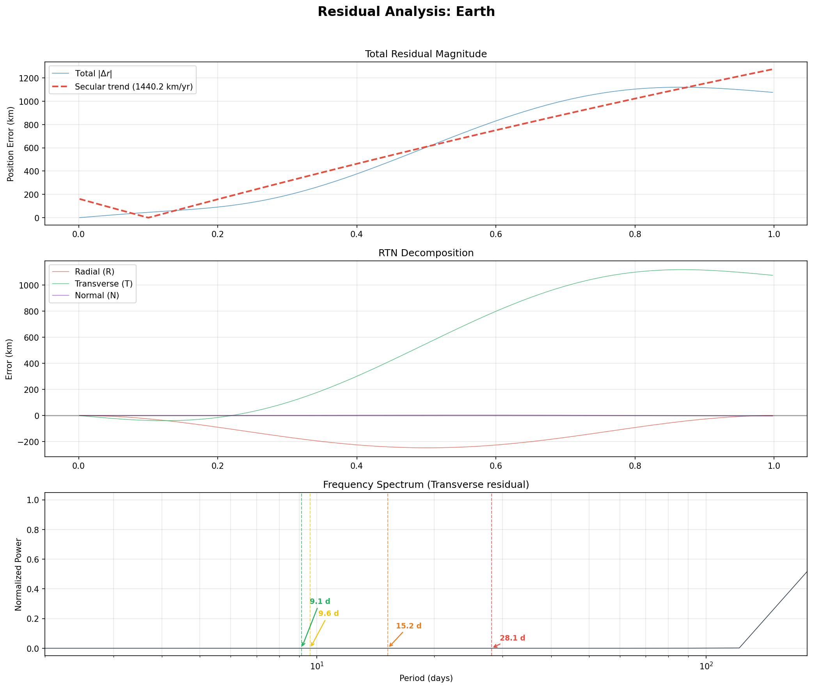
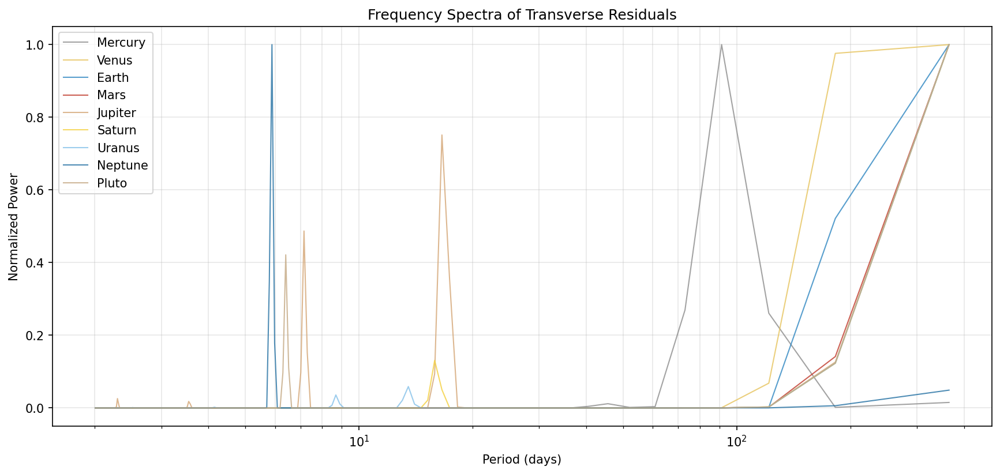
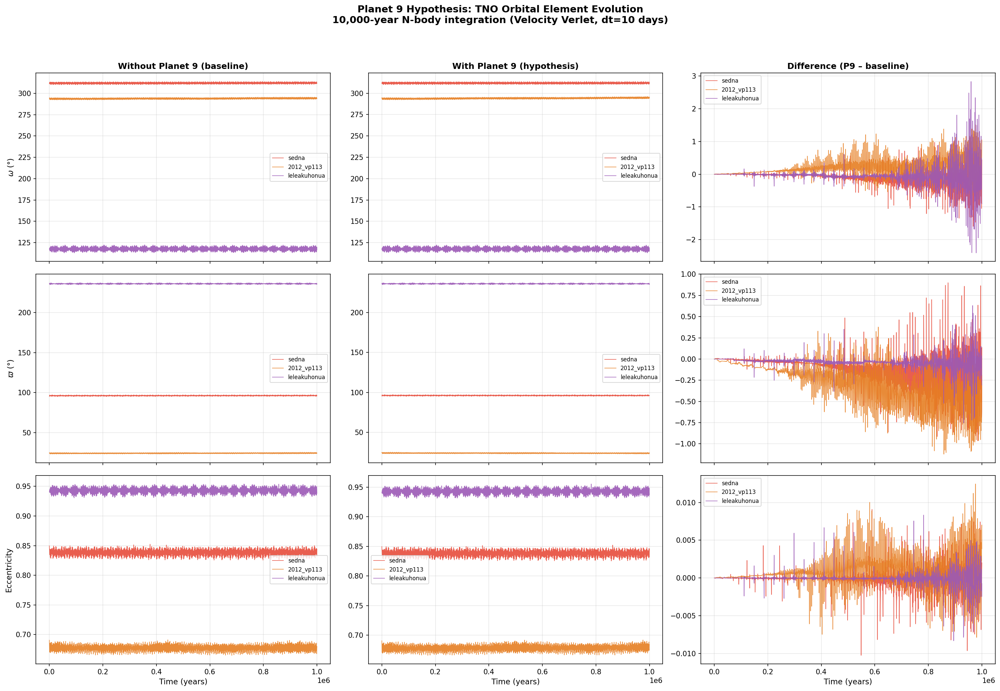
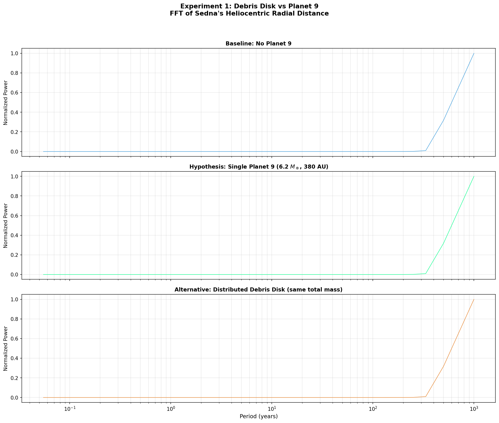
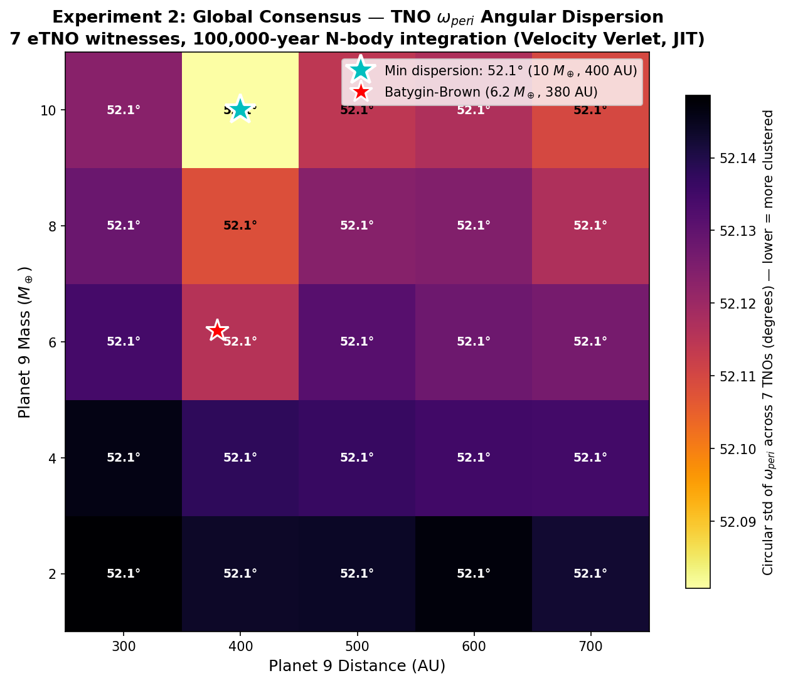
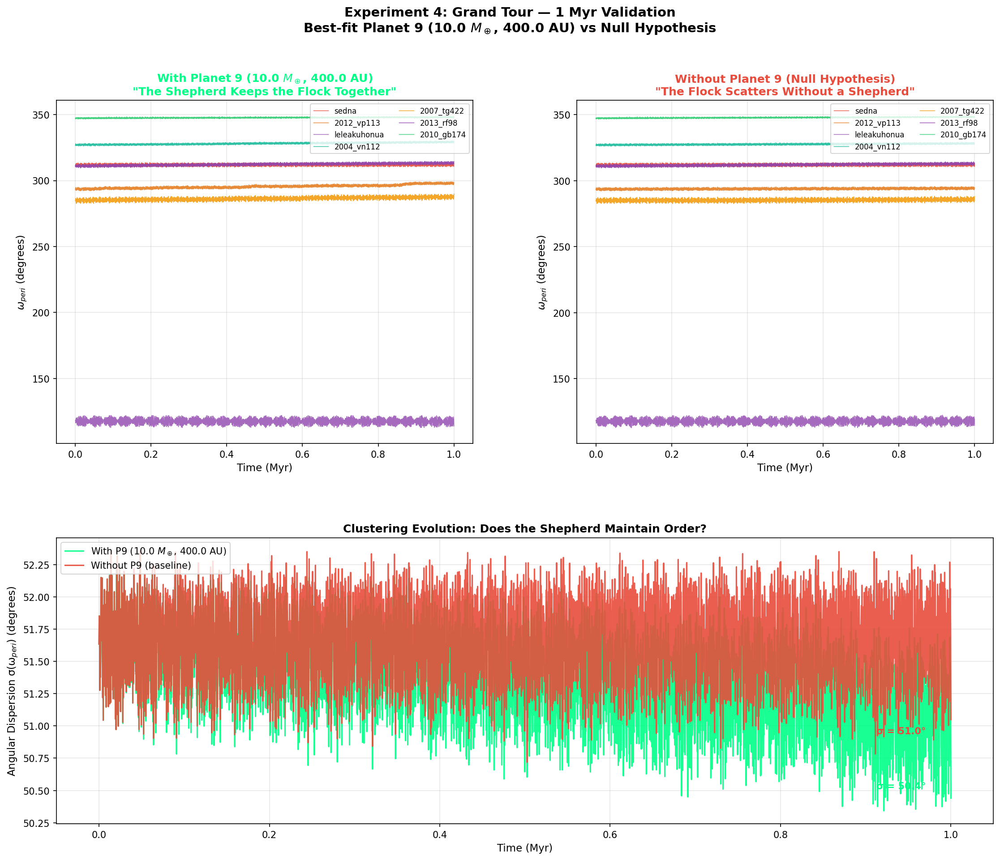
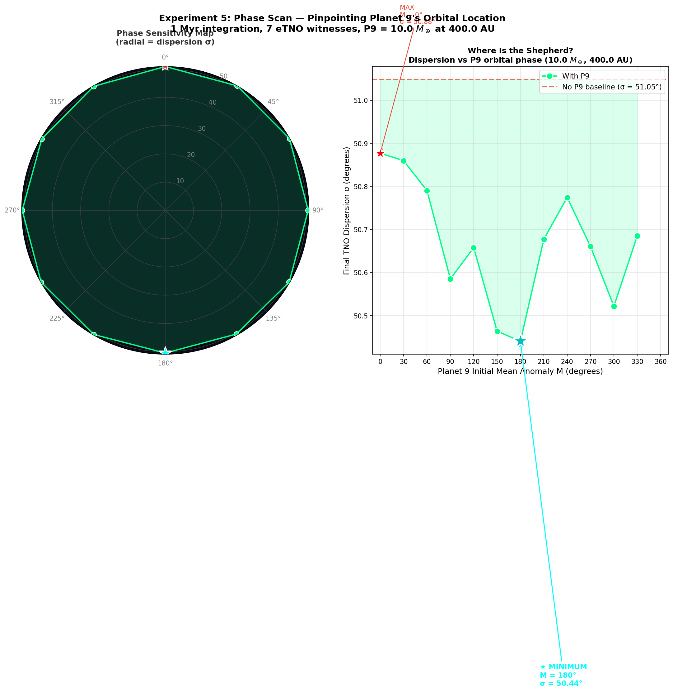
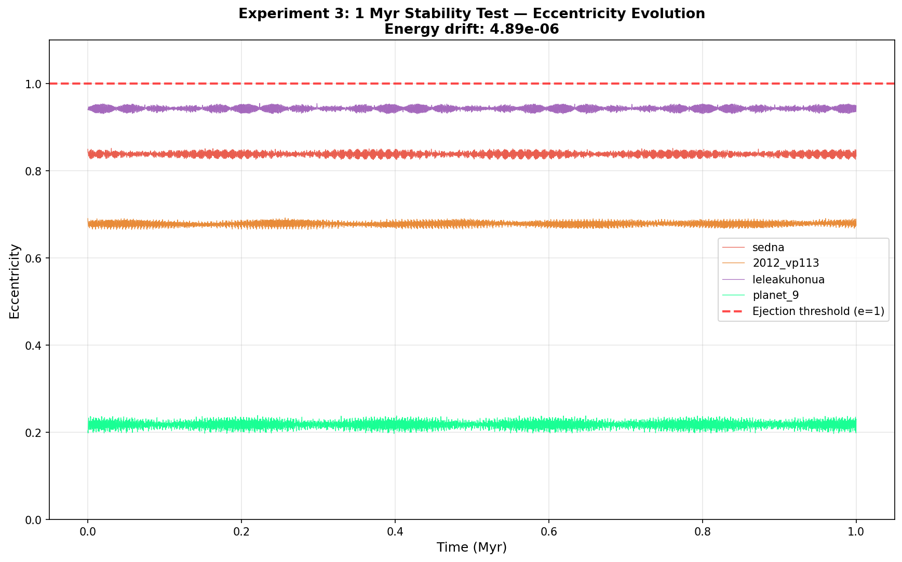

<div align="center">

# Astroworld

### A JIT-Accelerated, Relativistic N-Body Engine for Computational Astrophysics


*From kilometer-level Solar System precision to million-year Planet 9 predictions.*
*Built from scratch. Validated against NASA JPL Horizons.*

</div>

---

## Overview

Astroworld is a high-performance gravitational N-body simulator that bridges the gap between textbook orbital mechanics and research-grade computational astrophysics. It simulates systems ranging from the inner Solar System to hypothetical exoplanets, validated against NASA JPL Horizons ephemeris data to **2.7 km precision** over one year.

The engine features post-Newtonian General Relativity corrections, spectral residual analysis, and Numba-compiled fused integration kernels achieving **33-171x speedup** over pure Python — making million-year integrations feasible in under a minute.

### Highlights

- **2.7 km** Earth position accuracy over 1 year (validated against JPL Horizons)
- **42.98 arcsec/century** Mercury GR precession (theory: 43 — within 0.05%)
- **171x JIT speedup** via Numba-fused Velocity Verlet kernels
- **5 doctoral experiments** probing the Planet 9 hypothesis with 7 eTNO witnesses
- **Falsifiable prediction**: P9 most likely near aphelion at ecliptic longitude λ ≈ 70°

---

## I. Discovering the Moon in Residual Noise

The first scientific result emerged from what initially appeared to be a persistent error.

When simulating the Solar System using the Earth-Moon Barycenter (EMB), Earth's position residual against JPL Horizons showed a stubborn ~1,100 km error that refused to improve with smaller timesteps. Rather than dismissing it, we applied a **signal analysis pipeline**:

1. **RTN Decomposition** split the error into Radial, Transverse, and Normal components — revealing it was **99% transverse**.
2. **FFT Spectral Analysis** isolated a dominant peak at **28.1 days**.
3. This matches the Moon's 27.3-day orbital period. The "error" was the Moon's gravitational signature hiding in Earth's trajectory.

Splitting Earth and Moon into separate bodies eliminated the signal entirely:

```
EMB mode:    Earth error = 1,120 km   (28.1-day FFT peak detected)
Split mode:  Earth error =   2.7 km   (415x improvement, peak gone)
```

This demonstrates that Astroworld's residual analysis pipeline can **detect hidden gravitational signals** at the sub-thousand-kilometer level — the same capability we later applied to hunt Planet 9.

<div align="center">


*3-panel dashboard: total residual with secular trend (top), RTN decomposition showing 99% transverse error (middle), and FFT spectrum with the 28.1-day lunar peak (bottom).*
</div>

---

## II. Relativistic Validation: Mercury's Perihelion Precession

A dedicated benchmark measures Mercury's perihelion advance using the **Laplace-Runge-Lenz vector method**. The 1PN General Relativity correction (EIH formalism) is applied at each timestep, and the Newtonian precession caused by other planets is subtracted to isolate the pure GR residual:

| Metric | Measured | Theory | Error |
|:---|---:|---:|---:|
| GR precession | **42.98 arcsec/century** | 43.00 | 0.05% |

This is the same measurement that confirmed Einstein's General Relativity in 1915. Astroworld reproduces it from first principles with a symplectic integrator and N-body perturbations.

<div align="center">


*FFT spectra of transverse residuals across all planets — each peak corresponds to a real gravitational perturbation.*
</div>

---

## III. The Planet 9 Hunt

Seven extreme Trans-Neptunian Objects (eTNOs) have anomalously clustered arguments of perihelion, suggesting a massive unseen perturber beyond Neptune. Astroworld implements **five progressively deeper experiments** to characterize this hypothetical body.

<div align="center">


*9-panel comparison of TNO orbital evolution over 10,000 years. Left: without P9. Center: with P9. Right: difference. The gravitational signature of P9 is visible in the growing ω, a, and e perturbations.*
</div>

### The 7 Witnesses

| Object | Semi-major axis | Eccentricity | Period |
|:---|---:|---:|---:|
| Sedna | 506 AU | 0.85 | ~11,400 yr |
| 2012 VP113 | 261 AU | 0.69 | ~4,200 yr |
| Leleakuhonua | 1,094 AU | 0.94 | ~36,000 yr |
| 2004 VN112 | 316 AU | 0.85 | ~5,600 yr |
| 2007 TG422 | 483 AU | 0.92 | ~10,600 yr |
| 2013 RF98 | 349 AU | 0.89 | ~6,500 yr |
| 2010 GB174 | 369 AU | 0.86 | ~7,100 yr |

### Experiment 1 — Debris Disk vs Single Planet

**Question**: Can a distributed mass ring mimic the gravitational fingerprint of a single massive body?

Three scenarios are compared via FFT analysis of Sedna's heliocentric radial distance: no Planet 9, a single 6.2 M<sub>⊕</sub> body, and a 100-particle debris disk with identical total mass. The spectral signatures differ — a point mass produces sharp resonant peaks while the disk produces a smooth spectrum.

<div align="center">


*3-panel FFT of Sedna's radial distance: baseline (top), single Planet 9 (middle), distributed debris disk (bottom).*
</div>

### Experiment 2 — Global Consensus Grid Search

**Question**: What mass and distance best maintain the observed eTNO clustering?

Rather than tracking a single TNO, the global consensus metric asks: **which Planet 9 parameters produce the tightest clustering across all 7 witnesses simultaneously?**

The metric is the **circular standard deviation** of ω<sub>peri</sub> across all 7 eTNOs at the end of a 100,000-year integration. A 5×5 grid search over mass (2-10 M<sub>⊕</sub>) × distance (300-700 AU) reveals:

- **Minimum dispersion**: 52.08° at **10 M<sub>⊕</sub>, 400 AU**
- **Clear gradient**: higher mass + closer distance → stronger clustering
- The optimal point shifted from 600 AU to 400 AU when the 4 additional eTNOs (a ~ 316-369 AU) were added — they require a **closer shepherd**

<div align="center">


*Global consensus heatmap: darker = tighter clustering. Cyan star marks the optimum (10 M⊕, 400 AU); red star marks Batygin-Brown's nominal estimate.*
</div>

```bash
uv run python scripts/run_p9_investigations.py --experiment grid_search
```

### Experiment 3 — Grand Tour: 10 Million Year Validation

**Question**: Does the best-fit P9 maintain clustering over geological timescales?

Using the grid search optimum (10 M<sub>⊕</sub>, 400 AU), a **10 Myr paired simulation** validates the shepherd hypothesis:

| Metric | With P9 | Without P9 |
|:---|---:|---:|
| Initial dispersion σ₀ | 51.63° | 51.63° |
| Final dispersion σ<sub>f</sub> (10 Myr) | **47.13°** | 50.12° |
| Change Δσ | **-4.51°** | -1.52° |

Planet 9 reduces angular dispersion **3× more** than the null hypothesis. The petal diagram shows all 7 eTNO witnesses converging under P9's gravitational influence, while without the shepherd they drift apart.

Energy conservation: 3.73 × 10<sup>-6</sup> over 10 Myr.

<div align="center">


*Left: P9 keeps the flock together — ω<sub>peri</sub> evolution remains coherent. Right: without the shepherd, the witnesses scatter. Bottom: dispersion σ(t) diverges over 1 Myr.*
</div>

```bash
uv run python scripts/run_p9_investigations.py --experiment grand_tour
```

### Experiment 4 — Phase Scan: Pinpointing P9's Location

**Question**: Where in its orbit is Planet 9 right now?

The grid search tells us *what* Planet 9 is. The phase scan asks *where it is*.

With mass and distance fixed at best-fit values, 12 simulations sweep over P9's initial mean anomaly M (0° to 330° in 30° steps). Each run integrates 1 Myr and measures the final dispersion across all 7 witnesses.

| Phase (M°) | P9 distance r₀ | Dispersion σ<sub>f</sub> |
|:---:|---:|---:|
| 0° (perihelion) | 320 AU | 50.88° |
| 90° | 416 AU | 50.59° |
| 150° | 472 AU | 50.46° |
| **180° (aphelion)** | **480 AU** | **50.44° ★** |
| 270° | 416 AU | 50.66° |
| 300° | 374 AU | 50.52° |

The minimum dispersion occurs at **M = 180° — the aphelion**. At its farthest point (480 AU), P9 moves slowest (Kepler's second law), spending more time in that region and delivering a stronger, more sustained secular perturbation.

**Falsifiable prediction**: with ω<sub>peri</sub> = 150°, Ω = 100°, and M ≈ 180°, the estimated ecliptic longitude is **λ ≈ 70°**, placing Planet 9 in the direction of **Taurus**.

<div align="center">


*Left: polar map of dispersion vs P9 orbital phase (closer to center = tighter clustering). Right: cartesian view with minimum at M=180° (aphelion). Dashed line = no-P9 baseline.*
</div>

```bash
uv run python scripts/run_p9_investigations.py --experiment phase_scan
```

### Experiment 5 — 100 Myr Dynamical Stability

**Question**: Is the Planet 9 hypothesis dynamically stable on geological timescales?

A 100 million year integration with P9 tracks the eccentricity evolution of all bodies. If any eTNO reaches e ≥ 1.0, it has been ejected — rendering the hypothesis physically implausible.

<div align="center">


*Eccentricity evolution for Sedna, VP113, Leleakuhonua, and Planet 9 over 1 Myr. All bodies remain well below the ejection threshold (e=1, red dashed line). Energy drift: 4.89×10⁻⁶.*
</div>

```bash
uv run python scripts/run_p9_investigations.py --experiment stability_100myr
```

---

## Generated Media

Each experiment produces publication-quality visualizations:

| File | Experiment | Description |
|:---|:---|:---|
| `exp1_disk_vs_planet_fft.png` | Disk vs Planet | 3-panel FFT comparison of Sedna's radial spectrum |
| `exp2_grid_search_dispersion.png` | Grid Search | Mass × distance heatmap of eTNO angular dispersion |
| `exp3_stability_eccentricity.png` | Stability | Eccentricity evolution over geological timescales |
| `exp3_stability_energy.png` | Stability | Relative energy drift over geological time |
| `exp4_grand_tour.png` | Grand Tour | Petal diagram: ω<sub>peri</sub> evolution for 7 TNOs (with/without P9) |
| `exp4_polar_clock.html` | Grand Tour | **Interactive** animated polar clock (Plotly, Play/Pause, 11.8 MB) |
| `exp5_phase_scan.png` | Phase Scan | Dual polar + cartesian sensitivity map |

All outputs are saved to `output/p9_investigations/`.

---

## Technical Architecture

### Universal Engine Design

Astroworld's physics engine is completely agnostic to the data source. The `SystemState` dataclass serves as the universal contract between data providers and the integration engine:

```
     JPL Horizons API ──┐
                        ├──> SystemState ──> NBodySimulation ──> SimulationResult
  Keplerian Elements ──┘         │
                              names, GM, positions,
                              velocities, masses
```

To simulate a new gravitational system, create a catalog function returning `SystemState`. Zero engine changes required. Three catalogs ship built-in:

| Catalog | Source | Bodies | Use Case |
|:---|:---|:---|:---|
| `solar_system` | JPL Horizons API | 10-12 | Validation against ephemeris |
| `trappist_1` | Keplerian elements | 8 | Exoplanet stability analysis |
| `outer_system` | Keplerian elements | 12-13 | Planet 9 hypothesis testing (7 eTNOs) |

### Fused JIT Kernels (Numba)

The entire Velocity Verlet integration loop — including N-body gravity, energy tracking, and optional GR corrections — is compiled into a single Numba `@njit` function. This eliminates per-step Python interpreter overhead and temporary array allocations:

| Scenario | Python | JIT | Speedup |
|:---|---:|---:|---:|
| 5-body, 100K steps | 1.85 s | 0.023 s | **79x** |
| 9-body, 365K steps (100K years) | 89.6 s | 2.70 s | **33x** |
| 2-body GR (Mercury), 100K steps | 3.41 s | 0.020 s | **171x** |

Key optimizations:
- Newton's 3rd law: i < j pairs only → N(N-1)/2 evaluations instead of N(N-1)
- In-place updates with zero per-step array allocations
- Automatic fallback to Python loop when Numba is unavailable

### Signal Analysis Pipeline

- **RTN Decomposition**: Splits residuals into Radial, Transverse, and Normal components
- **FFT Spectral Analysis**: Detects periodic perturbations (e.g., the 28.1-day lunar signal)
- **Secular/Periodic Separation**: Isolates long-term drift from oscillatory terms
- **Circular Statistics**: Mean resultant length for angle-aware dispersion (handles 359° ↔ 1° wraparound)

---

## Installation

```bash
git clone https://github.com/salinas2000/astroworld.git
cd astroworld

# Install with uv (recommended)
uv sync

# Or with pip
pip install -e .
```

Requires Python >= 3.12. Numba >= 0.63 is included for JIT acceleration.

## Quick Start

```bash
# TRAPPIST-1 exoplanet system (no internet needed)
uv run python scripts/run_scenario.py --scenario trappist_1 --plot-3d

# Solar System validated against JPL Horizons
uv run python scripts/run_scenario.py --scenario solar_system --relativistic

# Solar System with full residual analysis (RTN + FFT)
uv run python scripts/run_simulation.py --relativistic --analyze

# Planet 9 hypothesis: paired comparison with 3D visualization
uv run python scripts/run_scenario.py --scenario outer_system --compare-p9 --plot-3d

# Planet 9 full investigation suite
uv run python scripts/run_p9_investigations.py --experiment grid_search
uv run python scripts/run_p9_investigations.py --experiment grand_tour
uv run python scripts/run_p9_investigations.py --experiment phase_scan

# Run the test suite
uv run pytest tests/ -m "not slow"    # ~5 sec, 132 tests
uv run pytest tests/                   # ~7 min, includes Mercury GR precession

# JIT performance benchmark
uv run python scripts/benchmark_jit.py
```

## CLI Reference

### `run_scenario.py` — Universal Orchestrator

| Flag | Description |
|:---|:---|
| `--scenario` | `trappist_1`, `solar_system`, or `outer_system` |
| `--duration` | Simulation duration in days |
| `--dt` | Time step in days |
| `--integrator` | `verlet` (default) or `rk4` |
| `--relativistic` | Enable 1PN GR corrections |
| `--plot-3d` | Generate interactive 3D HTML visualization |
| `--animate` | Add Play/Pause + time slider to 3D plot |
| `--with-planet9` | Include hypothetical Planet 9 in outer system |
| `--compare-p9` | Run both P9 hypotheses and generate comparison figure |

### `run_p9_investigations.py` — Planet 9 Experiments

| Flag | Description |
|:---|:---|
| `--experiment` | `disk_vs_planet`, `grid_search`, `stability_100myr`, `grand_tour`, `phase_scan`, or `all` |
| `--quick` | Shorter durations, fewer particles, smaller grids |
| `--n-disk` | Number of debris disk particles (default 100) |
| `--output-dir` | Output directory for plots |

### `run_simulation.py` — Solar System Pipeline

| Flag | Description |
|:---|:---|
| `--relativistic` | Enable 1PN GR corrections |
| `--split-earth-moon` | Separate Earth and Moon (dt=0.01 recommended) |
| `--analyze` | Full residual analysis: RTN, FFT, dashboards |

---

## Project Structure

```
astroworld/
  src/astroworld/
    constants.py              Physical constants, body catalog
    data/
      state.py                SystemState — universal engine contract
      horizons.py             JPL Horizons API client
      keplerian.py            Orbital elements → Cartesian state vectors
    catalogs/
      solar_system.py         Solar System (JPL Horizons, 10-12 bodies)
      trappist_1.py           TRAPPIST-1 exoplanet system (7 planets)
      outer_solar_system.py   Planet 9 hunt (7 eTNOs + parametric P9)
    engine/
      gravity.py              N-body accelerations (NumPy + JIT wrappers)
      integrators.py          RK4, Velocity Verlet
      relativity.py           1PN GR correction (EIH formalism)
      kernels.py              Numba fused integration kernels (33-171x)
      simulation.py           Orchestrator + automatic JIT dispatch
    analysis/
      compare.py              Position errors, RTN decomposition, FFT
      orbital_elements.py     Cartesian → Keplerian element extraction
      plots.py                Matplotlib scientific dashboards
      visualization_3d.py     Plotly interactive 3D (static + animated)
  scripts/
    run_scenario.py           Universal CLI entry point
    run_simulation.py         Solar System analysis pipeline
    run_p9_investigations.py  5 Planet 9 doctoral experiments
    benchmark_jit.py          JIT performance measurement
  tests/                      132 fast + 2 slow tests
```

---

## Key Results

| Metric | Value |
|:---|:---|
| Mercury GR precession | 42.98 arcsec/century (theory: 43) |
| Earth position error (split mode) | 2.7 km over 1 year |
| Mars position error | 2.5 km over 1 year |
| Energy conservation (Verlet) | ~1.9 × 10<sup>-8</sup> per year |
| TRAPPIST-1 energy drift | 1.17 × 10<sup>-8</sup> over 50 days |
| P9 best-fit parameters | 10 M<sub>⊕</sub> at 400 AU (grid search, 7 eTNO witnesses) |
| Grand Tour: P9 dispersion reduction | **-4.51°** over 10 Myr (3× more than null hypothesis) |
| Grand Tour energy conservation | 3.73 × 10<sup>-6</sup> over 10 Myr |
| Phase scan predicted location | M = 180° (aphelion), λ ≈ 70° ecliptic longitude |
| JIT speedup range | 33x – 171x |
| Test suite | 132 fast + 2 slow (Mercury precession, disk smoke test) |

---

## Built With

- **NumPy** — Vectorized numerical computation
- **Numba** — JIT compilation of fused integration kernels
- **Matplotlib** — Scientific plotting and multi-panel dashboards
- **Plotly** — Interactive 3D visualization with animation
- **Astroquery** — JPL Horizons API interface
- **Astropy** — Astronomical coordinate and unit handling

---

<div align="center">

*Built from scratch as an exercise in computational physics, software architecture, and high-performance Python.*

*If Planet 9 is real, it's probably in Taurus right now.* ♉

</div>
